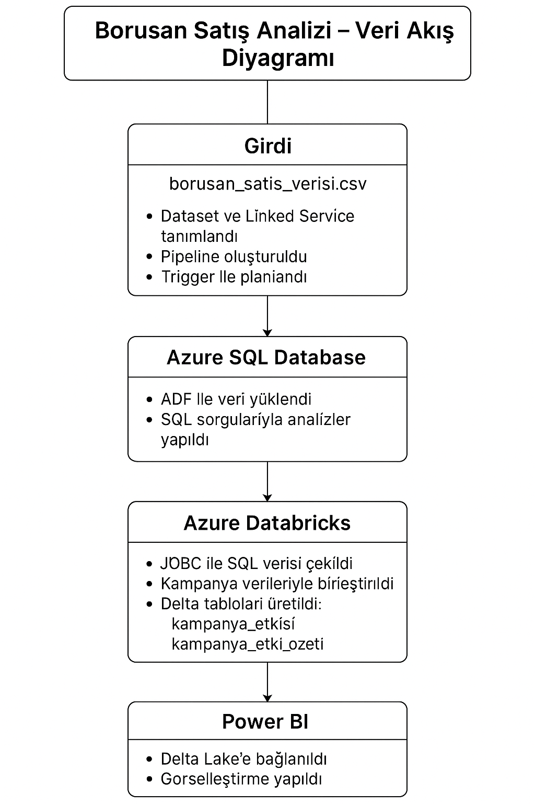

# borusan-sales-analysis
Azure ADF, Databricks ve Power BI ile kampanya etkisi analizi projesi.

# Borusan Satış Verisi Kampanya Etki Analizi

Bu proje, Borusan Otomotiv'in satış performans verilerini analiz ederek kampanyaların satışlar üzerindeki etkisini ölçmek amacıyla geliştirilmiştir. Projede, uçtan uca veri süreci oluşturulmuş ve veriler çeşitli araçlar aracılığıyla işlenmiştir.

## 🎯 Proje Amacı

Satış hedefleri ve gerçekleşen satışlar arasında nasıl bir ilişki olduğu ve belirli bayilerde yürütülen kampanyaların satış başarım oranına etkisi merak konusuydu. Bu kapsamda:

- Kampanya yapılan ve yapılmayan bayilerin satış başarım oranlarını karşılaştırmak,
- Marka bazlı satış adetlerini incelemek,
- Genel satış başarısını ölçmek
amaçlandı.

## ⚙️ Kullanılan Teknolojiler

- **Azure Data Factory (ADF):** Veri aktarım pipeline’ı oluşturmak ve otomatikleştirmek için.
- **Azure SQL Database:** Satış verilerinin merkezi veri tabanı olarak tutulması.
- **Azure Databricks (PySpark):** Verilerin işlenmesi ve analiz edilmesi.
- **Power BI:** Verilerin görselleştirilmesi ve interaktif raporların oluşturulması.
- **GitHub:** Proje versiyon kontrolü ve paylaşımı.
  
## Veri Akış Diyagramı

## 🛠️ Süreç Adımları

### 1. Veri Aktarımı (ADF Pipeline)

- `borusan_satis_verisi.csv` adlı dosya Azure Data Lake'e yüklendi.
- Azure Data Factory kullanılarak bir ETL pipeline oluşturuldu.
- Bu süreç bir **trigger** ile zamanlanarak otomatik hale getirildi.

#### 📊 ADF Pipeline Veri Akışı

#### ADF Aktiviteleri Özeti

| 🔧 Alan           | 📝 Değer                              |
|------------------|----------------------------------------|
| Pipeline Adı     | `pipeline_borusan`                    |
| Aktivite Türü    | `Copy Activity`                       |
| Kaynak Dataset   | `DS_Borusan_CSV (DelimitedText)`      |
| Hedef Dataset    | `DS_Borusan_SQL (Azure SQL)`          |
| Timeout          | `12 saat`                             |
| Retry Sayısı     | `0`                                   |

#### Veri Şeması ve Dönüşümler

| 📁 Kaynak Kolon     | 🎯 Hedef Kolon     | 🔄 Tür         |
|---------------------|--------------------|----------------|
| Tarih               | tarih               | String → DateTime |
| Bayi Adı            | bayi_adi            | String → String   |
| Şehir               | sehir               | String → String   |
| Marka               | marka               | String → String   |
| Satış Adedi         | satis_adedi         | String → Int32    |
| Hedef Satış         | hedef_satis         | String → Int32    |

### 2. SQL Server Üzerinde İlk Analizler

- Bayi, şehir ve marka bazlı toplam satış ve hedef karşılaştırmaları yapıldı.
- Günlük satış trendleri çıkarıldı.
- SQL sorguları `sql queries/` klasöründe yer almaktadır.

### 3. Databricks ile Kampanya Etki Analizi

- Satış verileri Azure SQL’den JDBC bağlantısıyla çekildi.
- `kampanyalar.csv` dosyası ile eşleştirme yapılarak bayilere kampanya bilgisi eklendi.
- Kampanya olan ve olmayan bayiler için başarı oranları hesaplandı.
- Sonuçlar iki ayrı Delta Lake tablosuna yazıldı:
  - `kampanya_etkisi`
  - `kampanya_etki_ozeti`

Kod detayları `notebooks/borusan_sales_analysis.py` dosyasında bulunmaktadır.

### 4. Power BI ile Görselleştirme

Power BI üzerinden SQL Warehouse’a bağlanılarak:
- Toplam ortalama başarı oranı
- Marka bazlı satış adetleri
- Kampanyaların satış başarısına etkisi

gibi görselleştirmeler oluşturulmuştur.

Görsel çıktı `.pbix` dosyasında yer almaktadır.

## 📊 Elde Edilen Sonuçlar

- Kampanya yapılan bayilerde başarı oranı belirgin şekilde daha yüksektir.
- Bazı markalar (örneğin Jaguar) satış adetlerinde öne çıkmaktadır.
- Genel satış başarım oranı yaklaşık **%55** olarak hesaplanmıştır.

